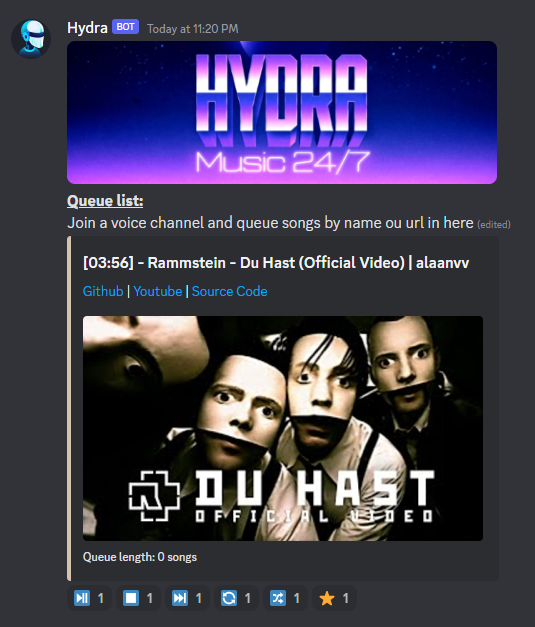
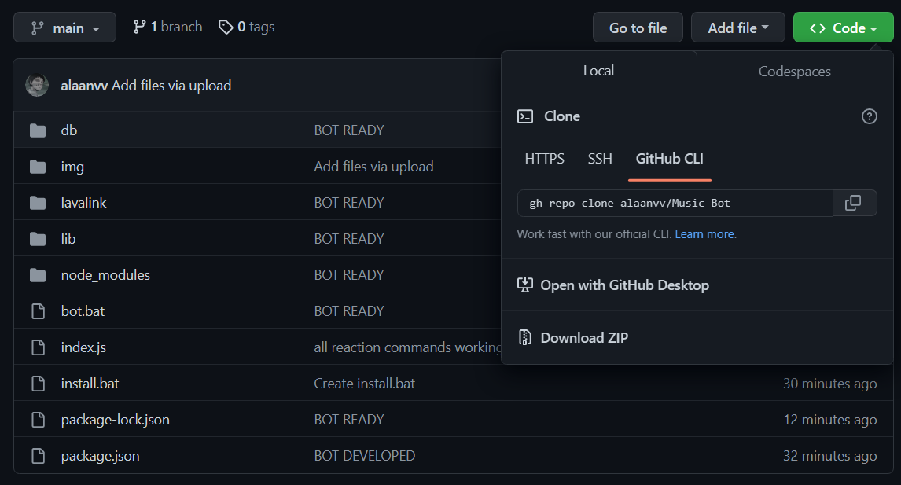

# Verse Music

Verse-Music is a music-bot that supports  
a lot of sources, including Youtube and  
Spotify, it also have a playlist system  
 

## Installation

 - Download <a href='https://nodejs.org/en/'>Node</a> and <a href='https://www.java.com/en/'>Java</a> (You probably already have it)
 - Download and unzip this repository 
 
 
 - Complete `config/config.json`
 - Execute `install.bat`
 - If you want Slash Commands, execute `uploadSlash.bat`
 - Now the bot is ready, when you want to use it,  
run `run-lavalink.bat`, then `bot.bat`

A list with all commands can be found <a href='https://github.com/alaanvv/Verse-Music/blob/main/commands.md'>here</a>  
You can use this code as you want, if its possible, let a link for my github as credit
